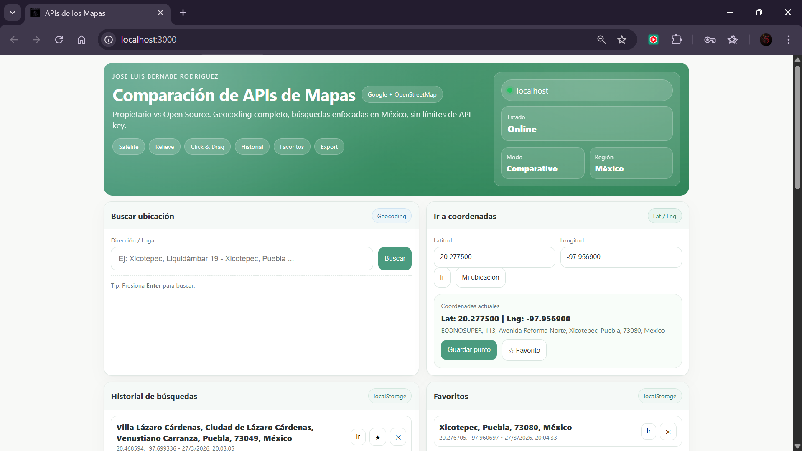
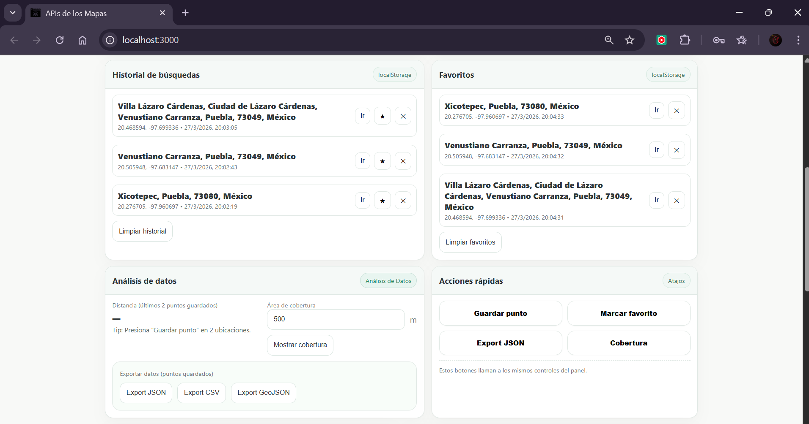
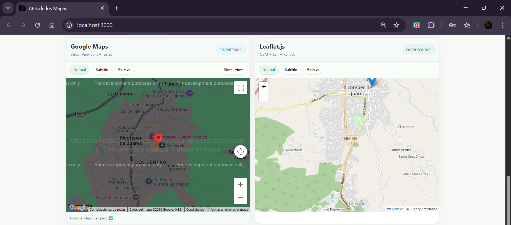
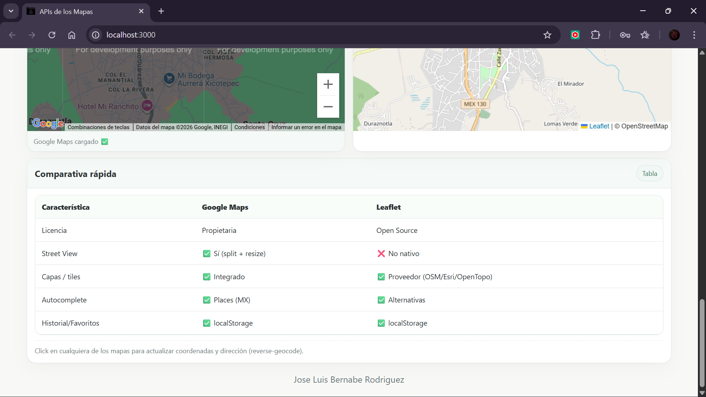

# Práctica 03: Consumo de API's para Geolocalización

<p align="justify">
En esta práctica se desarrolló una aplicación web que compara dos APIs de mapas (<strong>Google Maps</strong> y <strong>Leaflet</strong>) para la visualización de geolocalización, utilizando <strong>Node.js</strong>, <strong>Express</strong> y <strong>Tailwind CSS</strong>.  
El objetivo es demostrar los conceptos teóricos y los requerimientos tecnológicos necesarios para el consumo de APIs de Geolocalización mediante una implementación funcional y comparativa.
</p>

---

## 📌 Consideraciones

<p align="justify">
La práctica fue desarrollada utilizando una estructura de ramas, una por cada fase, con la finalidad de aplicar correctamente el control de versiones y el flujo de trabajo colaborativo mediante el uso de <strong>Git</strong> y <strong>GitHub</strong>, asegurando una correcta evolución del proyecto.
</p>

---

## 📋 Tabla de Fases y Actividades

| No. | Descripción | Puntaje | Estatus |
|:---:|---|:---:|:---:|
| 0 | Crear el repositorio del código fuente | 1 | ✅ Finalizada |
| 1 | Fase 1: Inicialización del Proyecto | 3 | ✅ Finalizada |
| 2 | Fase 2: Configuración del Servidor (Express) | 4 | ✅ Finalizada |
| 3 | Fase 3: Configuración de la Librería de Estilos (Tailwind CSS) | 4 | ✅ Finalizada |
| 4 | Fase 4: Creación de Vistas (EJS) | 4 | ✅ Finalizada |
| 5 | Fase 5: Implementación de Backend para Consumo (JS) | 4 | ✅ Finalizada |
| 6 | Fase 6: Configuración del Entorno de Ejecución | 2 | ✅ Finalizada |
| 7 | Fase 7: Pruebas de Ejecución | 2 | ✅ Finalizada |
| 8 | Fase 8: Documentación | 2 | ✅ Finalizada |
| 9 | Generación de una API Key propia para Google Maps | 2 | ✅ Finalizada |

---

## 🛠️ Tecnologías y Requisitos

- **Entorno de Ejecución:** Node.js  
- **Framework Web:** Express.js  
- **Motor de Vistas:** EJS  
- **Estilizado:** Tailwind CSS  
- **APIs de Mapas:** Google Maps JavaScript API y Leaflet.js  
- **Proveedor de Mapas (Leaflet):** OpenStreetMap  
- **Control de Versiones:** Git y GitHub  
- **Variables de Entorno:** dotenv  
- **Almacenamiento Local:** localStorage  
- **Entorno:** ejecución local en `localhost`

---

## 📸 Evidencias de Funcionamiento

### 1️⃣ Interfaz Principal de la Aplicación
  
*Visualización del panel principal de la aplicación, donde se muestran los módulos de búsqueda por dirección y coordenadas, así como el estado del sistema y la interfaz responsiva.*

---

### 2️⃣ Historial, Favoritos y Análisis de Datos
  
*Funcionamiento de los módulos de historial, favoritos, análisis de datos y acciones rápidas. Se observa el uso de `localStorage` y la exportación de información en formatos JSON, CSV y GeoJSON.*

---

### 3️⃣ Comparación Visual entre Google Maps y Leaflet
  
*Renderizado simultáneo de Google Maps y Leaflet.js, mostrando la misma ubicación y permitiendo comparar el comportamiento de ambas APIs.*

---

### 4️⃣ Tabla Comparativa de APIs
  
*Sección comparativa integrada en la aplicación donde se muestran diferencias entre Google Maps y Leaflet en aspectos como licencia, Street View, capas, autocompletado e historial.*

---

## 🚀 Instalación y Uso

### 1️⃣ Clonar el repositorio
```bash
git https://github.com/RodriguezBJLuis/AWOS_Practica03_240480.git

### 2️⃣ Entrar a la carpeta del proyecto
cd AWOS_Practica03_240480

### 3️⃣ Instalar las dependencias
npm install

### 4️⃣ Configurar variables de entorno

Crear un archivo .env en la raíz del proyecto con el siguiente contenido:

NODE_ENV=development
PORT=3000
GOOGLE_MAPS_WEB_KEY=TU_API_KEY_WEB
GOOGLE_MAPS_SERVER_KEY=TU_API_KEY_SERVER

### 5️⃣ Iniciar el servidor
npm start
```

---

